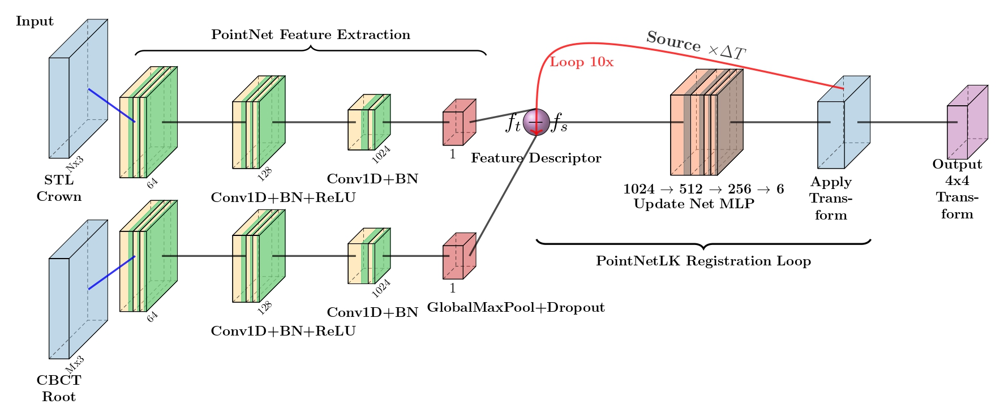

# MICCAI 2025 – Semi-Supervised IOS–CBCT Registration (STSR Task 2)

This repository contains the public release of our semi-supervised framework for aligning intraoral scans (IOS) with cone-beam CT (CBCT).  
The implementation extends the official STSR Task-2 Baseline while incorporating our point-cloud registration design and semi-supervised optimization strategy.

## Method Summary
Our method employs a PointNetLK-style iterative registration module tailored for IOS–CBCT alignment:

- PointNet-based feature extraction using stacked Conv1D–BN–ReLU layers.
- Global max pooling to obtain descriptors for both IOS and CBCT point sets.
- A feature-difference vector fed to a compact update network.
- Prediction of incremental 6-DoF transformations.
- Iterative refinement through repeated application of the predicted updates.
- Final output: a rigid **4×4 transformation** mapping IOS → CBCT.

This design accommodates partial visibility and sparse anatomical overlap common in dental scans.

### Training & Semi-Supervised Approach 
.png)

Two-Stage Semi-Supervised Training Protocol 

In the first stage, the model is trained using only the available labeled scan pairs to establish an initial registration baseline. In the second stage, this trained model is used to produce pseudo-labels for the unlabeled data, after which low-confidence predictions are filtered out. The model is then fine-tuned on the mixture of true labels and reliable pseudo-labels. This strategy helps mitigate the limited availability of annotated CBCT–IOS data in real clinical environments.



---

## Environment Setup

### 1. Install Requirements
```bash
pip install -r requirements.txt
```
### 2. Dataset

Download the official STSR-Task-2 dataset from Codabench (competition page).
https://www.codabench.org/competitions/6468/

### 3. All preprocessing, organization, and validation file generation are handled inside:
```bash
organised_complete_validation_file.py
```

### 4. Inference

Using the Provided Model
sh predict.sh

---

## Contact

For questions or clarifications, please contact drajo_george@DiceMed.in
